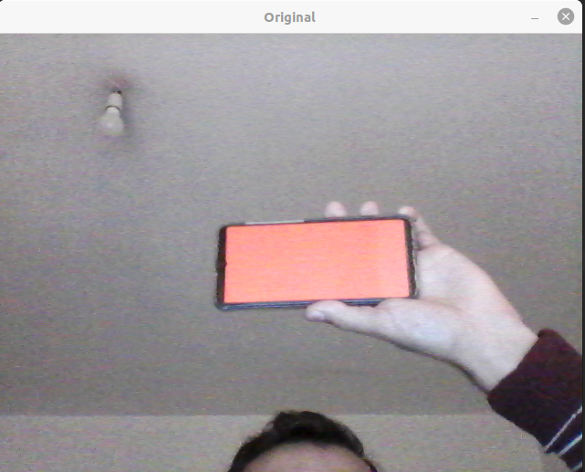
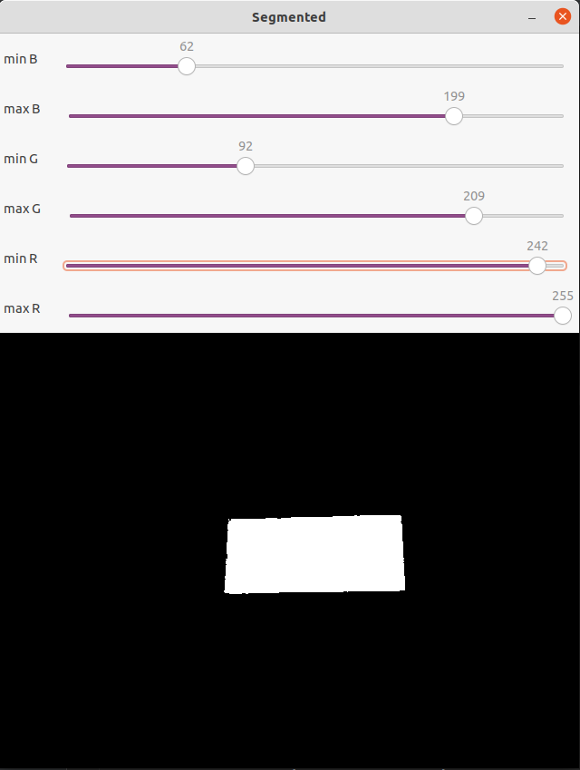
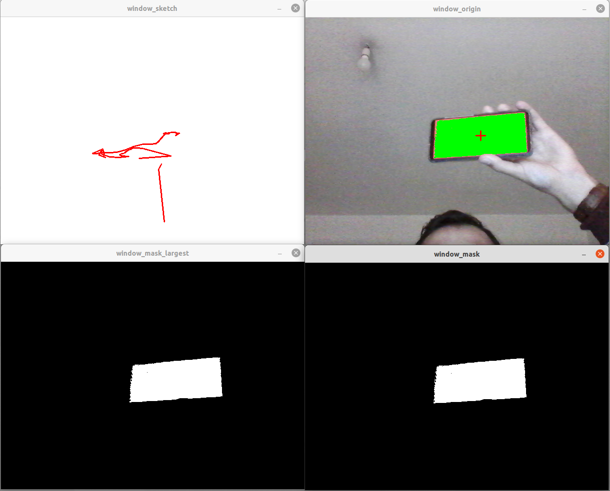
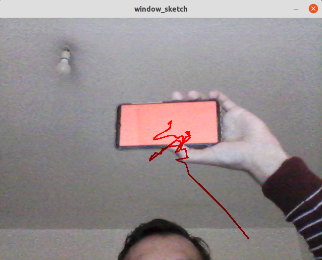
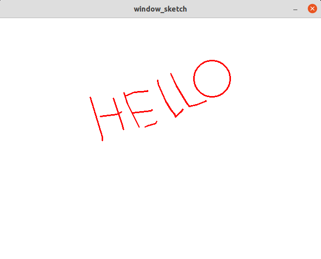
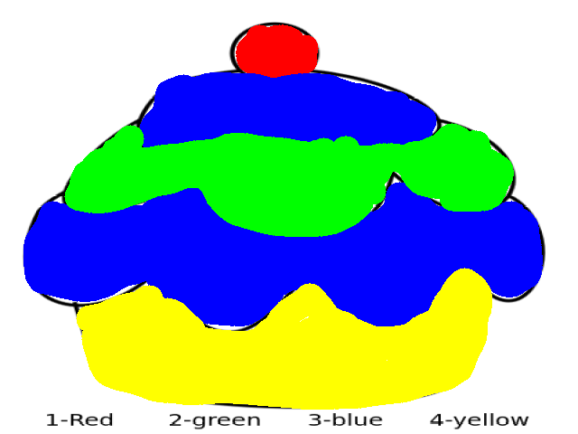
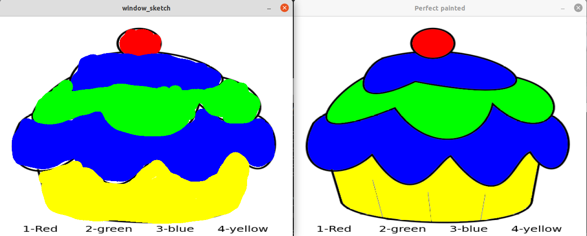

# PSR_TP2_G7
PSR Augmented Reality Paint: Assignment 2 of subject Programação de Sistemas Robóticos at Universidade de Aveiro.

This program aims to let the user draw as they wish as well as evaluate their drawing and painting accuracy.

# Table of Contents
- [color_segmenter.py](#color_segmeter.py)
  - [Usage color segmenter](#Color_Segmenter_Usage)
  - [Results color segmenter](#Color_Segmenter_Results)
- [ar_paint.py](#ar_paint.py)
  - [Arguments](#Arguments)
  - [Usage ar paint](#Ar_paint_usage)
  - [Results ar paint](#Ar_paint_Results)

#color_segmenter.py
The color segmenter program has the objective of making a color filter so that the user can choose the color that is on 
their smartphone to be the only one to be seen by ar_paint.py.

# Usage color segmenter
If the user run the command 
    
    ./color_segmenter.py

The program will open a webcam and the segmented windows.

    Welcome to our color segmenter program. 

    Contributors: 
    Rafael Inacio Siopa 
    Rodrigo Dinis Martins Ferreira  
    Bartosz Bartosik 

    PSR, University of Aveiro, November 2021.

    Press w to save the trackbars' limits.
    Press q to quit the program

    

# Results color segmenter

When the 'w' key is pressed, the limits are saved in the limits.json file.

    Writing dictionary ranges to file limits.json

# ar_paint.py
The ar_paint.py program has the objective of using the mobile phone with the fixed color chosen in color_segmenter.py
to draw on a white screen, closely resembling the well known paint program. However, there are some variants like 
changing the white screen to the webcam video, using the mouse instead of the webcam, drawing circles and squares, etc...

# Arguments

To launch the program, the user can enter 3 input arguments: 

-The json file full path, which is required.

-The use shake prevention is an optional argument. If not given, it is by default not activated.

-The image to paint, which the user can choose from 1, 2 or 3. 

# Usage ar paint

If you run the command: 

    /ar_paint.py -j limits.json -usp

The 4 windows below will appear:

In the terminal you can see: 

    Welcome to our Augmented Reality Paint program. 

    Contributors: 
    Rafael Inacio Siopa 
    Rodrigo Dinis Martins Ferreira  
    Bartosz Bartosik 
    
    PSR, University of Aveiro, November 2021.
    
    Press r to change to red color.
    Press g to change to green color.
    Press b to change to blue color.
    Press y to change to yellow color.
    Press p to change to orange color.
    Press k to change to black color.
    Press + to increase the thickness of the pencil
    Press - to decrease the thickness of the pencil
    Press m to use the mouse as the pencil.
    Press v to change the white board to the video stream.
    Press s to draw squares.
    Press o to draw circles.
    Press c to clear the sketch
    Press w to save the sketch
    Initializing with red color as default.

If 'v' is pressed: 

If 's' is pressed:

If 'o' is pressed:

If 'm' is pressed:

If you run the command: 

    /ar_paint.py -j limits.json -usp -i 1

The four windows bellow will appear:

And all the commands showed above also work in that mode. 

# Results ar paint

The user can save the image that they drew or painted by pressing the 'w' key.
The terminal will show:

    drawing_qua_nov_24_21:24:56_2021.png saved.

This is an example of our paintings:

The program can also do an evaluation of the painting. To activate it just press 'e'. The terminal will then show:
    
    Beginning evaluation...
    Well done. A little bit of practice and you will be the next Van Gogh!
    Accuracy= 87.06 %

The perfectly painted picture will then appear so that the user can compare their work. 

