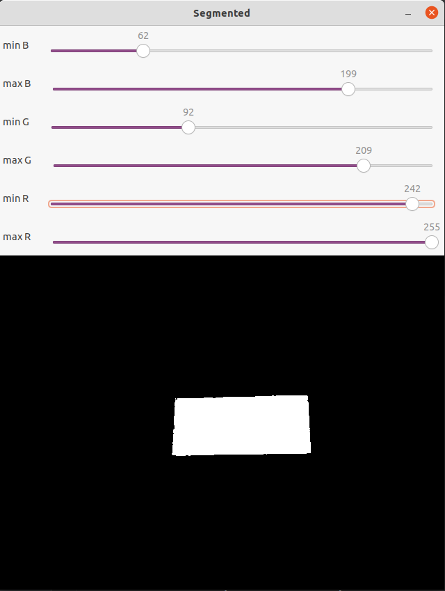
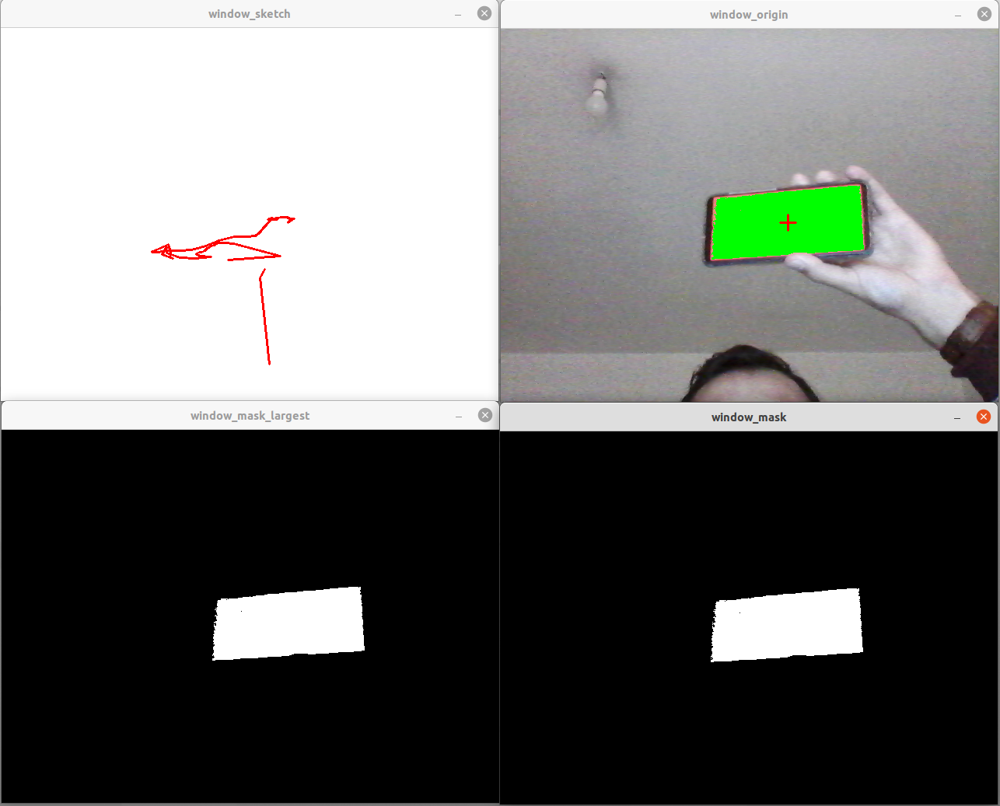
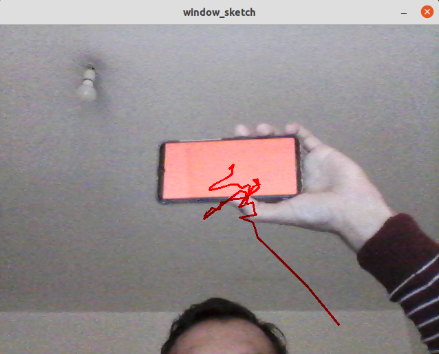
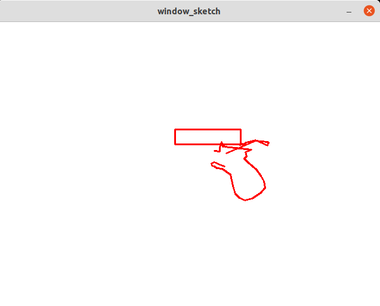
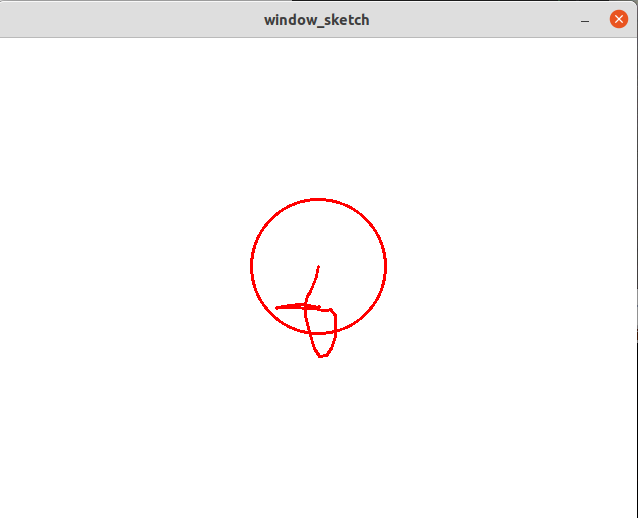
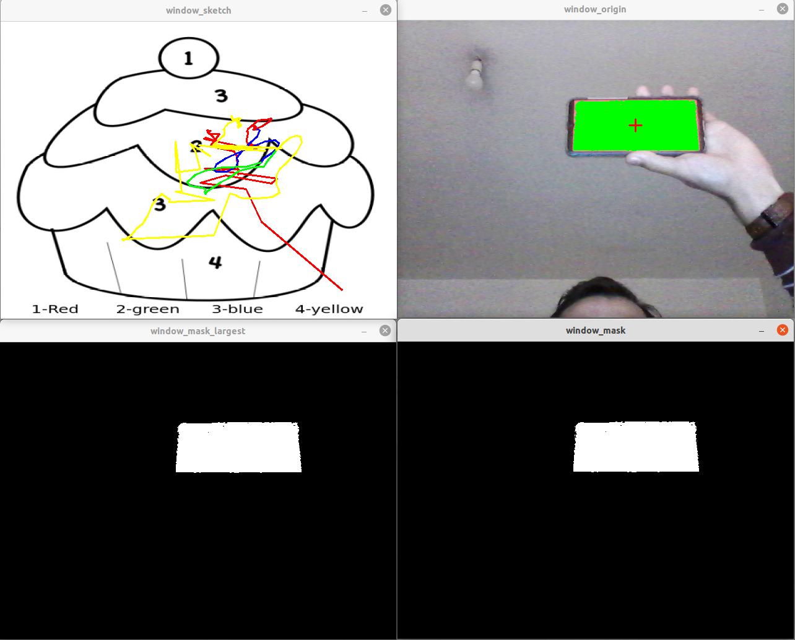
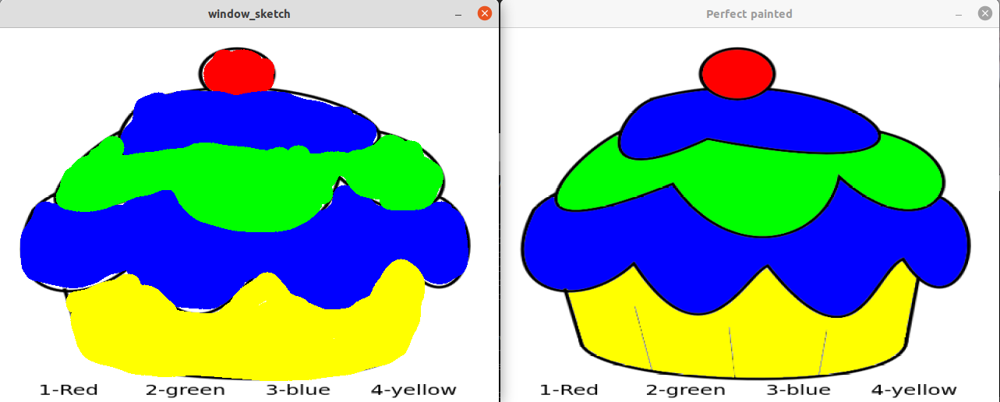

# PSR_TP2_G7
PSR Augmented Reality Paint: Assignment 2 of subject Programação de Sistemas Robóticos at Universidade de Aveiro.

This program aims to evaluate your drawing and painting accuracy.

# Table of Contents
- [color_segmenter.py](#color_segmeter.py)
  - [Usage](#Color Segmenter Usage )
  - [Results](#Color Segmenter Results )
- [ar_paint.py](#ar_paint.py)
  - [Arguments](#Arguments)
  - [Usage](#Ar_paint usage)
  - [Results](#Ar_paint Results)

# color_segmeter.py
The color segmeter program has the objective of making a color filter so that we can make the color that is on our 
 smartphone work is the only one that is seen by ar_paint.py.

#Color Segmenter Usage  
For example, if the user run the command 
    
    ./color_segmenter.py

The program will open a webcam and the segmented windows.

    Welcome to our color segmenter program . 

    Contributors: 
    Rafael Inacio Siopa 
    Rodrigo Dinis Martins Ferreira  
    Bartosz Bartosik 

    PSR, University of Aveiro, November 2021.

    Press 'w' to save the trackbars limits.
    Press 'q' to to quit the program

    

#Color Segmenter Results 

The result is when 'w' key is pressed the limits are saved in limits.json file

    Writing dictionary ranges to file limits.json

#ar_paint.py
The ar_paint.py program has the objective of using the mobile phone with a fixed color to draw on a white screen as if 
it were the paint program. There are some variants like changing the white screen to the webcam video, using the mouse 
instead of the webcam, drawing circles and squares, etc...

#Arguments

To launch the program, the user can enter 3 additional input arguments: 

-The json file full path.

-The use shake prevention is an optional argument. If not given is by default not activated.

-The image to paint that is 1, 2 or 3. 

#Ar_paint usage

If you run the command: 

    /ar_paint.py -j limits.json -usp

Will appear the 4 windows above:

In the terminal appears: 

    Welcome to our Augmented Reality Paint program . 

    Contributors: 
    Rafael Inacio Siopa 
    Rodrigo Dinis Martins Ferreira  
    Bartosz Bartosik 
    
    PSR, University of Aveiro, November 2021.
    
    Press r to change to red color.
    Press g to change to green color.
    Press b to change to blue color.
    Press y to change to yellow color.
    Press p to change to orange color.
    Press k to change to black color.
    Press + to increase the thickness of the pencil
    Press - to decrease the thickness of the pencil
    Press m to use the mouse as the pencil.
    Press v to change the white board to the video stream.
    Press s to draw squares (once for the starting point and again for the finishing point).
    Press o to draw circles.
    Press c to clear the sketch
    Press w to save the sketch
    Initializing with red color as default.

If 'v' is pressed: 

If the 's' is pressed:

If the 'c' is pressed:

If the 'm' is pressed:

If you run the command: 

    /ar_paint.py -j limits.json -usp -i 1

Will appear the 4 windows above:

And all the commands showed above work in that mode too. 

#Ar_paint Results

The results of that program is that we can save the image that we draw or paint pressing the key 
'w'. The terminal show:

    drawing_qua_nov_24_21:24:56_2021.png saved.

That's an example of our art:

The program have an evaluation of the paint. For activate just press 'e'. The terminal show:
    
    Beginning evaluation...
    Well done. A little bit of practice and you will be the next Van Gogh!
    Accuracy= 87.06 %

And then show the perfect paint to make you jealous. 

